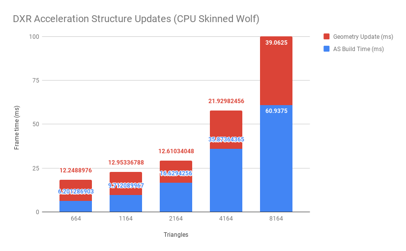

# Hazumu
Alexander Chan and Emily Vo

## Goal
Analyzing dynamic animated scenes with DXR.

## Summary
[Link to slides](https://docs.google.com/presentation/d/13p2GebDdX0fR9fK_T6GdMJvwfSSTqB0XvoTX17432ps/edit?usp=sharing)

In a traditional rasterization pipeline, skeletal animation is done entirely on the GPU in the vertex shader. However, with raytracing, this technique is unavailable, as the entire scene along with the acceleration structure must be sent to the GPU before rendering happens. Transforming the vertices individually on the CPU will affect performance greatly. The vertices are transformed per frame in a CUDA kernel, and the acceleration structure is refitted, rather than rebuilt from scratch. Raytracing skeletal animation should be more performance intensive than rigid body animation since different parts of the mesh can move in different ways, and it is not enough to simply inverse transform a ray based on the updated bounding box of the rigid body transformation.

We initially used assimp to read in fbx files containig skeletons and animations. However, many of the tests we used had a mismatch between the skeletons and the meshes, as well as having multiple meshes. We were unsure as to how cases like these are supposed to be handled, so we opted for simpler meshes and animations.

In the end, we were able to raytrace an animated mesh. We added a large triangle sim around the animated mesh to analyze how fast acceleration structure updates take in DXR.

## Performance
The following analysis was performed on a GTX 1080 @ 1620 MHz 8GB and an i7-5820k @ 3.70 GHz 16GB.

Above are timing graphs for raytracing the skinned wolf. As expected, GPU skinning is faster than CPU skinning. However, refitting the acceleration structure is also slightly faster. Doubling the number of triangles in the scene roughly doubles the time taken to update the acceleration structure. The only benchmark to hit the target of 60fps was the fewest number of triangles, 664. This is also with no lighting calculation.

## Requirements
* Windows 10
* [Visual Studio 2017](https://www.visualstudio.com/) with the [Windows 10 October 2018 Update SDK (17763)](https://developer.microsoft.com/en-US/windows/downloads/windows-10-sdk)

## Acknowledgements
This code is based on the [DirectX raytracing samples](https://github.com/Microsoft/DirectX-Graphics-Samples/tree/master/Samples/Desktop/D3D12Raytracing/src).

The Titan V used for this project was donated by the NVIDIA Corporation.

We gratefully acknowledge the support of NVIDIA Corporation with the donation of the Titan V GPU used for this project.

## References
- assimp
- glm